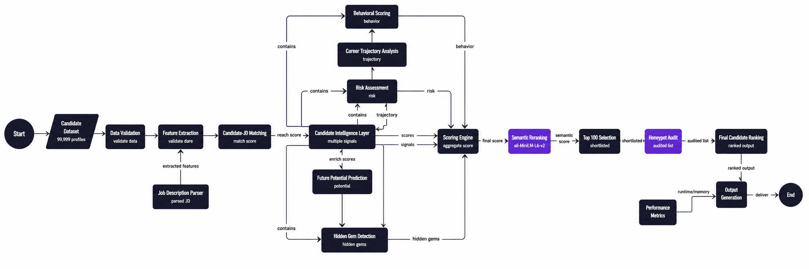
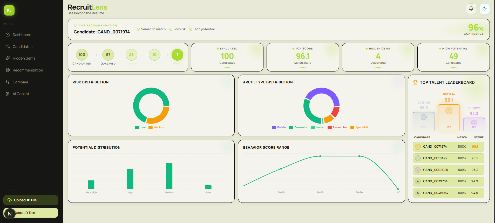
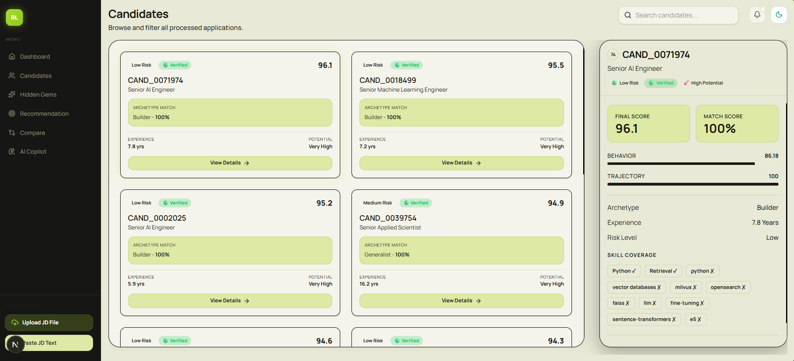
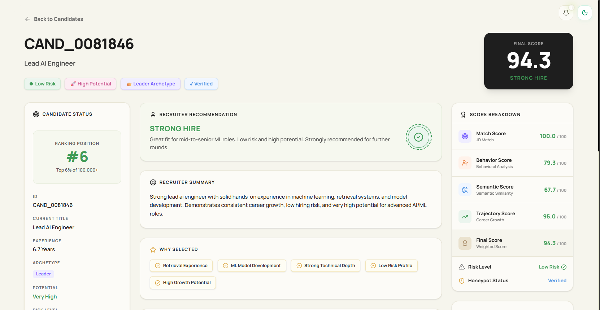
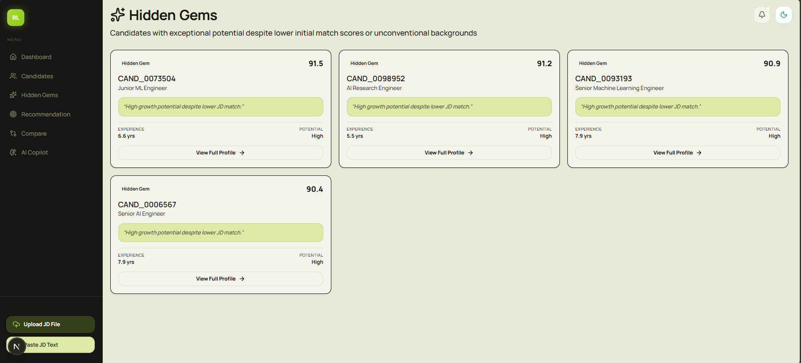

# RecruitLens

Candidate Ranking and Recruitment Analytics Platform

---

## Overview

RecruitLens is an end-to-end recruitment intelligence platform that ranks candidates using a hierarchical, multi-stage evaluation pipeline instead of conventional keyword-based screening. The system combines structured profile analysis, job-description matching, behavioral intelligence, career trajectory evaluation, risk assessment, semantic similarity, and explainable decision logic to identify the most relevant candidates.

Each candidate progresses through validation, feature extraction, weighted scoring, semantic reranking using **all-MiniLM-L6-v2**, and a final honeypot audit before being included in the recruiter-ready Top-100 shortlist. Every ranking is supported by deterministic scoring, transparent decision traces, and measurable candidate signals, ensuring accurate, consistent, and explainable hiring recommendations.
# 🎬 Product Walkthrough


## Technology Stack 

| **Layer**                    | **Technology**             | **Purpose**                    |
| ---------------------------- | -------------------------- | ------------------------------ |
| Programming Language         | Python 3                   | Backend implementation         |
| Frontend Framework           | Next.js, React, TypeScript | Recruiter dashboard            |
| API Framework                | FastAPI                    | Backend API integration        |
| Data Processing              | Pandas, NumPy              | Data preprocessing & analytics |
| NLP Framework                | Sentence Transformers      | Semantic embedding generation  |
| Embedding Model              | all-MiniLM-L6-v2           | Candidate–JD encoding          |
| Similarity Metric            | Cosine Similarity          | Semantic relevance scoring     |
| Validation                   | JSON Schema (Draft 7)      | Candidate profile validation   |
| Visualization                | Tailwind CSS, Recharts     | Interactive dashboards         |
| Deployment & Version Control | Git, GitHub, Vercel        | Source control & deployment    |

## System Architecture



## Core Modules

| Module                      | Purpose                                                                                           |
| --------------------------- | ------------------------------------------------------------------------------------------------- |
| Job Description Parser      | Extracts required skills, experience requirements, and role information from the job description. |
| Candidate-JD Matching       | Computes skill overlap, experience matching, and role relevance.                                  |
| Behavioral Scoring          | Evaluates profile quality, consistency, and behavioral indicators.                                |
| Career Trajectory Analysis  | Analyzes career growth, promotions, and leadership progression.                                   |
| Risk Assessment             | Identifies hiring risks and profile inconsistencies.                                              |
| Skill Gap Analysis          | Measures missing skills and estimates upskilling effort.                                          |
| Future Potential Prediction | Predicts long-term growth and leadership potential.                                               |
| Hidden Gem Detection        | Identifies promising candidates with lower initial match scores.                                  |
| Semantic Reranking          | Uses all-MiniLM-L6-v2 embeddings for semantic similarity scoring.                                 |
| Honeypot Audit              | Performs final verification on the Top 100 candidates.                                            |


## Performance Metrics

| Metric          | Value             |
| --------------- | ----------------- |
| Runtime         | 56.27 seconds     |
| Memory Usage    | 2.30 GB           |
| Compute         | CPU Only          |
| External APIs   | None              |
| Embedding Model | all-MiniLM-L6-v2  |
| Dataset Size    | 99,999 Candidates |

## Features

| Feature                        | Description                                                             |
| ------------------------------ | ----------------------------------------------------------------------- |
| Multi-Signal Candidate Ranking | Combines multiple evaluation signals instead of keyword matching alone. |
| Job Description Intelligence   | Extracts skills, experience, and role requirements from the JD.         |
| Behavioral Analysis            | Evaluates profile quality and candidate consistency.                    |
| Career Trajectory Analysis     | Measures career growth and progression patterns.                        |
| Risk Assessment                | Identifies potential hiring risks.                                      |
| Skill Gap Analysis             | Detects missing skills and upskilling requirements.                     |
| Future Potential Prediction    | Estimates long-term growth and leadership potential.                    |
| Hidden Gem Detection           | Finds promising candidates overlooked by traditional ranking.           |
| Semantic Reranking             | Uses MiniLM embeddings for contextual matching.                         |
| Honeypot Audit                 | Verifies Top 100 candidates for suspicious profiles.                    |
| Interactive Dashboard          | Provides recruiter analytics and candidate insights.                    |
| Candidate Profiles             | Detailed candidate evaluation pages with explanations.                  |

## Output Files

| File                   | Description                                                         |
| ---------------------- | ------------------------------------------------------------------- |
| submission.csv         | Final Top 100 ranked candidates submitted for evaluation.           |
| top100_audit.json      | Honeypot audit results for the Top 100 candidates.                  |
| ranked_candidates.json | Complete ranked candidate information with scores and explanations. |
| runtime_report.txt     | Runtime and memory usage statistics.                                |

## Installation

Clone the repository:

```bash
git clone <repository-url>

cd system
```

Install Python dependencies:

```bash
pip install -r requirements.txt
```

Install frontend dependencies:

```bash
cd frontend

npm install
```

## Dashboard Modules

| Module            | Description                            |
| ----------------- | -------------------------------------- |
| Dashboard         | Overall recruitment analytics and KPIs |
| Candidates        | Ranked candidate list                  |
| Candidate Profile | Detailed candidate evaluation          |
| Hidden Gems       | High-potential overlooked candidates   |
| Recommendations   | Recruiter recommendations              |
| Compare           | Candidate comparison                   |
| Analytics         | Score and hiring insights              |

## Candidate Evaluation Signals

| Signal           | Purpose                         |
| ---------------- | ------------------------------- |
| Match Score      | Candidate-job fit               |
| Behavior Score   | Profile quality and consistency |
| Trajectory Score | Career growth                   |
| Risk Level       | Hiring risk                     |
| Potential Score  | Future growth potential         |
| Semantic Score   | Contextual relevance            |
| Skill Gap Score  | Missing skills                  |
| Honeypot Status  | Suspicious profile detection    |

## Dashboard Preview

### Main Dashboard



### Ranked Candidates



### Candidate Biodata



### Hidden Gems



## Demo

🎥 Demo Video: `<video-link>`

## Live Dashboard

The interactive recruitment dashboard can be accessed here:

🔗 Dashboard: https://recruit-lens-nine.vercel.app/

## Future Improvements

- Incorporate Cross-Encoder reranking models to improve semantic relevance beyond embedding similarity.
- Introduce Learning-to-Rank algorithms using recruiter feedback and hiring outcomes.
- Develop graph-based candidate representations to model relationships between skills, roles, and career transitions.
- Implement explainable ranking techniques to provide feature-level score attribution.
- Enable large-scale vector search and real-time candidate indexing for production deployment.

## Acknowledgements

- India Runs Hack2Skill for providing the challenge dataset and evaluation framework.
- Hugging Face for the `sentence-transformers` ecosystem.
- `all-MiniLM-L6-v2` for semantic candidate matching.
- Next.js and Tailwind CSS for the dashboard implementation.
- Recharts for interactive analytics visualizations.

## Developer

 **Anmol Jana**

Designed and developed the complete recruitment intelligence platform, including the ranking pipeline, semantic matching engine, candidate evaluation framework, risk assessment system, and recruiter dashboard.

## Repository Structure

```text
system/
│
├── frontend/
├── outputs/
│   ├── submission.csv
│   ├── ranked_candidates.json
│   ├── top100_audit.json
│   └── runtime_report.txt
│
├── src/
│   ├── scoring/
│   ├── validation/
│   ├── ingestion/
│   └── jd_matching/
│
├── main.py
├── requirements.txt
└── README.md
```
